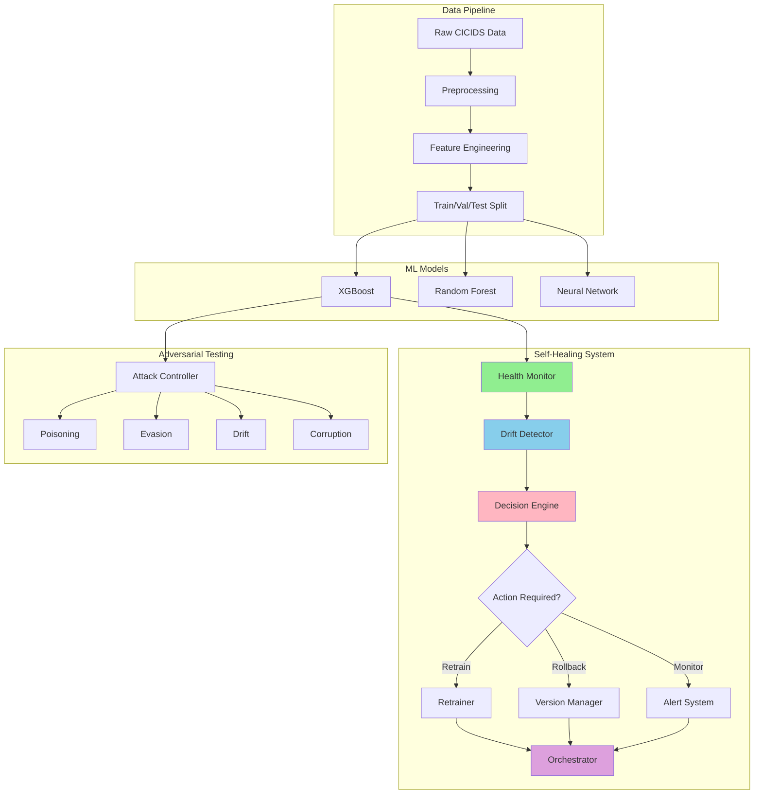

# 🛡️ Hydra-IDS: Production-Grade Intrusion Detection System with Self-Healing

A state-of-the-art ML-powered Intrusion Detection System featuring automated self-healing, adversarial testing, and comprehensive MLOps capabilities.


## 🎯 Overview

Hydra-IDS is an enterprise-grade intrusion detection system that combines advanced machine learning with automated operations. The system features:

- **🤖 Self-Healing ML Models**: Automated drift detection, health monitoring, and model retraining
- **⚔️ Adversarial Testing Framework**: Comprehensive attack simulation with 4 attack types
- **📊 Production-Grade MLOps**: Model versioning, rollback capabilities, and audit trails
- **🔍 Multi-Class Classification**: Detects 11 different attack types from network traffic
- **📈 Real-Time Monitoring**: Health metrics, drift detection, and alerting system

## 🏗️ System Architecture



## 🚀 Quick Start

### Installation

```bash
# Clone the repository
git clone https://github.com/yourusername/hydra-ids.git
cd hydra-ids

# Create virtual environment
python -m venv venv
source venv/bin/activate  # On Windows: venv\Scripts\activate

# Install dependencies
pip install -r requirements.txt
```

### Basic Usage

#### 1. Train Baseline Model

```bash
python scripts/train_optimized_model.py
```

#### 2. Run Self-Healing System

```python
from self_healing import SelfHealingOrchestrator, SelfHealingConfig
import pandas as pd
import joblib

# Load data and model
X_reference = pd.read_csv('data/processed/X_test.csv', nrows=1000)
X_current = pd.read_csv('data/processed/X_test.csv', skiprows=1000, nrows=1000)
y_current = pd.read_csv('data/processed/y_test.csv', skiprows=1000, nrows=1000).squeeze()
model = joblib.load('models/xgboost/xgboost_v1.joblib')

# Initialize and run
config = SelfHealingConfig()
orchestrator = SelfHealingOrchestrator(config)

report = orchestrator.run_healing_workflow(
    X_reference=X_reference,
    X_current=X_current,
    y_current=y_current,
    current_model=model,
    dry_run=True  # Set to False for production
)

print(f"Workflow completed: {report['success']}")
print(f"Recommended action: {report['final_action']}")
```

#### 3. Simulate Adversarial Attacks

```python
from attacks import AttackController
import pandas as pd
import joblib

# Load test data
X_test = pd.read_csv('data/processed/X_test.csv', nrows=1000)
y_test = pd.read_csv('data/processed/y_test.csv', nrows=1000).squeeze()
model = joblib.load('models/xgboost/xgboost_v1.joblib')
scaler = joblib.load('models/preprocessing/scaler.joblib')

# Initialize controller
controller = AttackController(
    config={'drift_strength': 0.3, 'epsilon': 0.05},
    model=model,
    scaler=scaler,
    track_history=True
)

# Set baseline
controller.set_baseline(X_test, y_test)

# Apply attack chain
X_attacked, y_attacked, metadata = controller.apply_attack_chain(
    X_test, y_test,
    attack_sequence=['drift', 'evasion', 'corruption']
)

# View results
print(f"Attack effectiveness: {metadata[-1]['chain_evaluation']['attack_effectiveness']:.3f}")
print(f"Accuracy drop: {metadata[-1]['chain_evaluation']['accuracy_drop']:.3f}")
```

## 📦 Project Structure

```
hydra-ids/
├── attacks/               # Adversarial testing framework
│   ├── controller.py     # Attack orchestration
│   ├── poisoning.py      # Data poisoning attacks
│   ├── evasion.py        # Evasion attacks
│   ├── drift.py          # Drift simulation
│   └── corruption.py     # Data corruption attacks
├── self_healing/         # Self-healing system (2,500+ lines)
│   ├── orchestrator.py   # Central workflow coordinator
│   ├── health_monitor.py # Model performance monitoring
│   ├── drift_detector.py # Multi-method drift detection
│   ├── decision_engine.py # Intelligent action selection
│   ├── retrainer.py      # Automated model retraining
│   ├── rollback.py       # Version management & rollback
│   ├── alert_system.py   # Multi-channel alerting
│   ├── config.py         # Pydantic configuration
│   └── exceptions.py     # Custom exception hierarchy
├── models/               # Trained models & artifacts
│   ├── xgboost/         # XGBoost models
│   ├── random_forest/   # Random Forest models
│   ├── preprocessing/   # Scalers, encoders, etc.
│   └── baseline/        # Model version registry
├── scripts/             # Data processing & training scripts
│   ├── preprocess_cicids.py      # Data preprocessing
│   ├── train_optimized_model.py  # Model training
│   └── merge_raw_csvs.py         # Data merging
├── notebooks/           # Jupyter notebooks & demos
│   ├── attack_simulation.ipynb   # Attack demo
│   ├── self_healing_demo.py      # Self-healing demo
│   └── test_self_healing.py      # Component tests
├── tests/               # Test suite
│   └── test_integration_realdata.py  # Integration tests
├── data/                # Dataset storage
│   ├── raw/            # Raw CICIDS data
│   ├── processed/      # Preprocessed data
│   └── logs/           # Execution logs
├── config/              # Configuration files
│   └── self_healing_example.yaml
└── docs/                # Documentation
    ├── ATTACK_FRAMEWORK_GUIDE.md
    └── ARCHITECTURE.md
```

## 🔧 Core Components

### 1. Self-Healing System

The self-healing system provides automated model maintenance with 9 production-grade components:

| Component | Description | LOC |
|-----------|-------------|-----|
| **HealthMonitor** | Tracks 6 metrics with  trend analysis | 320 |
| **DriftDetector** | 3 detection methods (KS, PSI, Wasserstein) | 420 |
| **DecisionEngine** | Confidence-based action selection | 370 |
| **Retrainer** | Incremental learning + Optuna tuning | 460 |
| **RollbackManager** | Full version control & audit trails | 410 |
| **AlertSystem** | Multi-channel notifications | 330 |
| **Orchestrator** | 5-stage workflow coordination | 450 |
| **Config** | Pydantic validation & YAML support | 380 |
| **Exceptions** | Custom exception hierarchy | 60 |

**Key Features**:
- ✅ **6 Health Metrics**: Accuracy, Precision, Recall, F1, ROC-AUC, PR-AUC
- ✅ **3 Drift Methods**: Kolmogorov-Smirnov, PSI, Wasserstein distance
- ✅ **Explainable Decisions**: Confidence scores + reasoning
- ✅ **Adaptive Thresholds**: Self-adjusting based on history
- ✅ **Full Audit Trails**: Complete action logging
- ✅ **Dry-Run Mode**: Test workflows without changes
- ✅ **Multi-Class Support**: Binary and multiclass classification

### 2. Adversarial Testing Framework

Comprehensive attack simulation for robustness testing:

| Attack Type | Description | Parameters |
|-------------|-------------|------------|
| **Poisoning** | Label flipping, feature noise | `label_flip_fraction`, `feature_noise` |
| **Evasion** | Gradient-based perturbations | `epsilon`, `strategy` |
| **Drift** | Gradual/sudden distribution shifts | `drift_strength`, `drift_type` |
| **Corruption** | Feature dropping, missing values, outliers | `drop_fraction`, `missing_fraction` |

**Key Features**:
- ✅ **Attack Chaining**: Combine multiple attacks
- ✅ **Metrics Tracking**: Attack effectiveness scoring
- ✅ **History & Rollback**: Undo attacks
- ✅ **Comprehensive Reporting**: JSON export

### 3. ML Models

Supports multiple model types with automatic pipeline handling:

- **XGBoost** (default): Best performance on CICIDS-2017
- **Random Forest**: Robust baseline
- **Neural Networks**: Deep learning option

**Model Performance on CICIDS-2017**:
- **Accuracy**: 83.24%
- **Precision**: 69.29% (weighted)
- **Recall**: 83.24% (weighted)
- **F1-Score**: 75.63% (weighted)

### 4. Data Pipeline

Production-grade preprocessing for CICIDS-2017 dataset:

1. **Excel → CSV Conversion**: Memory-efficient chunked processing
2. **CSV Merging**: Schema validation + deduplication
3. **Feature Engineering**: Scaling, encoding, feature selection
4. **Train/Val/Test Split**: Stratified splitting

**Supported Attack Classes**:
- Benign (0)
- DDoS (1, 2)
- DoS (3, 4, 5)
- PortScan (6)
- Botnet (7)
- Infiltration (8)
- Web Attacks (9, 10)

## 📊 Testing & Validation

### Run Integration Tests

```bash
# Test self-healing components
python notebooks/test_self_healing.py

# Run full integration test with real data
python tests/test_integration_realdata.py
```

### Test Results

All 7 integration tests passed:

| Test | Status | Details |
|------|--------|---------|
| Data Loading | ✅ PASSED | 5,000 samples, 45 features |
| Baseline Performance | ✅ PASSED | 83.24% accuracy |
| Health Monitoring | ✅ PASSED | Multiclass metrics tracked |
| Drift Detection | ✅ PASSED | 100% drift detection on synthetic |
| Decision Engine | ✅ PASSED | Confidence-based actions |
| Orchestrator Workflow | ✅ PASSED | End-to-end workflow completed |
| Component Summaries | ✅ PASSED | All components operational |

## 📚 Documentation

- **[Attack Framework Guide](docs/ATTACK_FRAMEWORK_GUIDE.md)**: Complete attack simulation tutorial
- **[Self-Healing Quick Reference](self_healing/QUICK_REFERENCE.md)**: Self-healing API reference  
- **[Configuration Guide](config/self_healing_example.yaml)**: Full configuration options

## 🎓 Example Workflows

### Monitor Model Health

```python
from self_healing import HealthMonitor, HealthMonitorConfig

config = HealthMonitorConfig(
    recall_threshold=0.85,
    precision_threshold=0.80,
    enable_trend_tracking=True
)

monitor = HealthMonitor(config)
health_result = monitor.evaluate(y_true, y_pred)

if not health_result['is_healthy']:
    print(f"Alert: Model degraded!")
    print(f"Metrics: {health_result['metrics']}")
```

### Detect Data Drift

```python
from self_healing import DriftDetector, DriftDetectorConfig

config = DriftDetectorConfig(
    methods=['ks', 'psi', 'wasserstein'],
    threshold=0.3
)

detector = DriftDetector(config)
drift_result = detector.detect(X_reference, X_current)

if drift_result['drift_detected']:
    print(f"Drift detected! Ratio: {drift_result['drift_ratio']:.2%}")
    print(f"Affected features: {drift_result['drifted_features']}")
```

### Full Self-Healing Workflow

```python
from self_healing import SelfHealingOrchestrator

# Run complete workflow
report = orchestrator.run_healing_workflow(
    X_reference=X_ref,
    X_current=X_cur,
    y_current=y_cur,
    current_model=model,
    X_train=X_train,
    y_train=y_train,
    dry_run=False  # Execute actions
)

# Check results
if report['success']:
    action = report['final_action']
    if action == 'retrain':
        print("Model retrained successfully!")
    elif action == 'rollback':
        print("Rolled back to previous version!")
```

## 🔮 Roadmap

### ✅ Completed
- [x] Core IDS model training
- [x] Self-healing system (2,500+ LOC)
- [x] Adversarial testing framework
- [x] Integration testing with real data
- [x] Comprehensive documentation

### 🚧 In Progress  
- [ ] Stress testing for production loads
- [ ] CI/CD pipeline enhancement
- [ ] Containerization (Docker/Kubernetes)
- [ ] Monitoring dashboard (Grafana)

### 📋 Future Enhancements
- [ ] Model explainability (SHAP)
- [ ] Advanced attack scenarios
- [ ] Multi-model ensemble
- [ ] Real-time inference API
- [ ] Distributed deployment support

## 🤝 Contributing

Contributions are welcome! Please see [CONTRIBUTING.md](CONTRIBUTING.md) for guidelines.

## 📄 License

This project is licensed under the MIT License - see the [LICENSE](LICENSE) file for details.

## 🙏 Acknowledgments

- **CICIDS-2017 Dataset**: Canadian Institute for Cybersecurity
- **MLOps Best Practices**: Inspired by production ML at scale
- **Open Source Community**: Built with amazing open-source tools

## 📞 Contact

For questions or support, please open an issue or contact the maintainers.

---

**Built with ❤️ for robust, production-ready intrusion detection**
