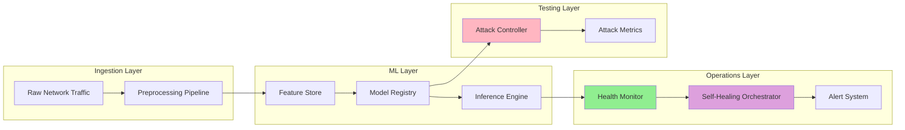
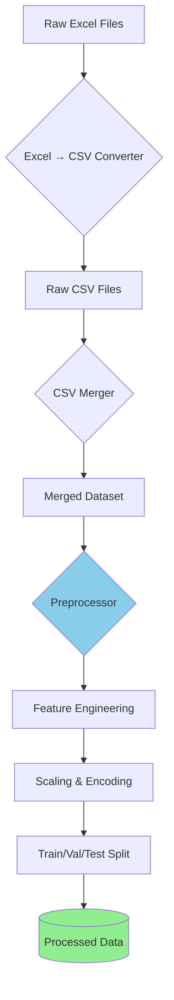
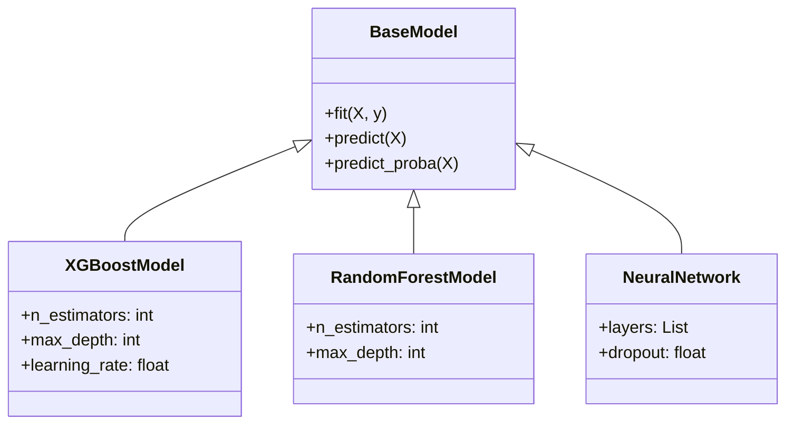
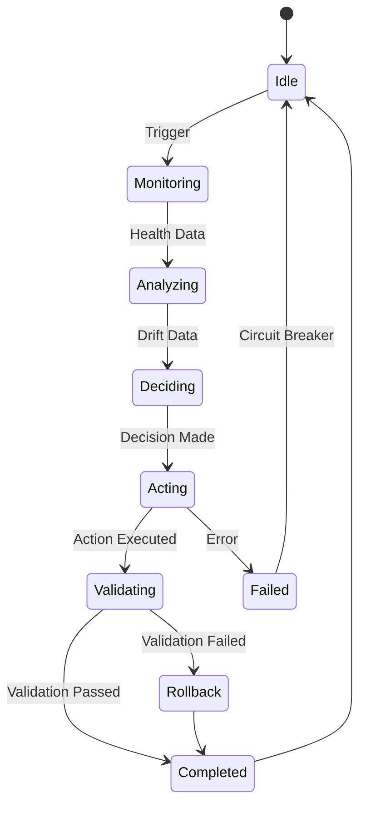
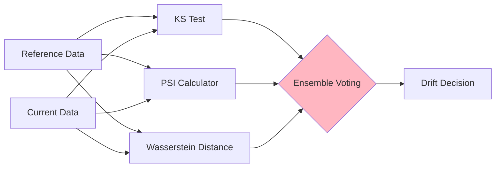
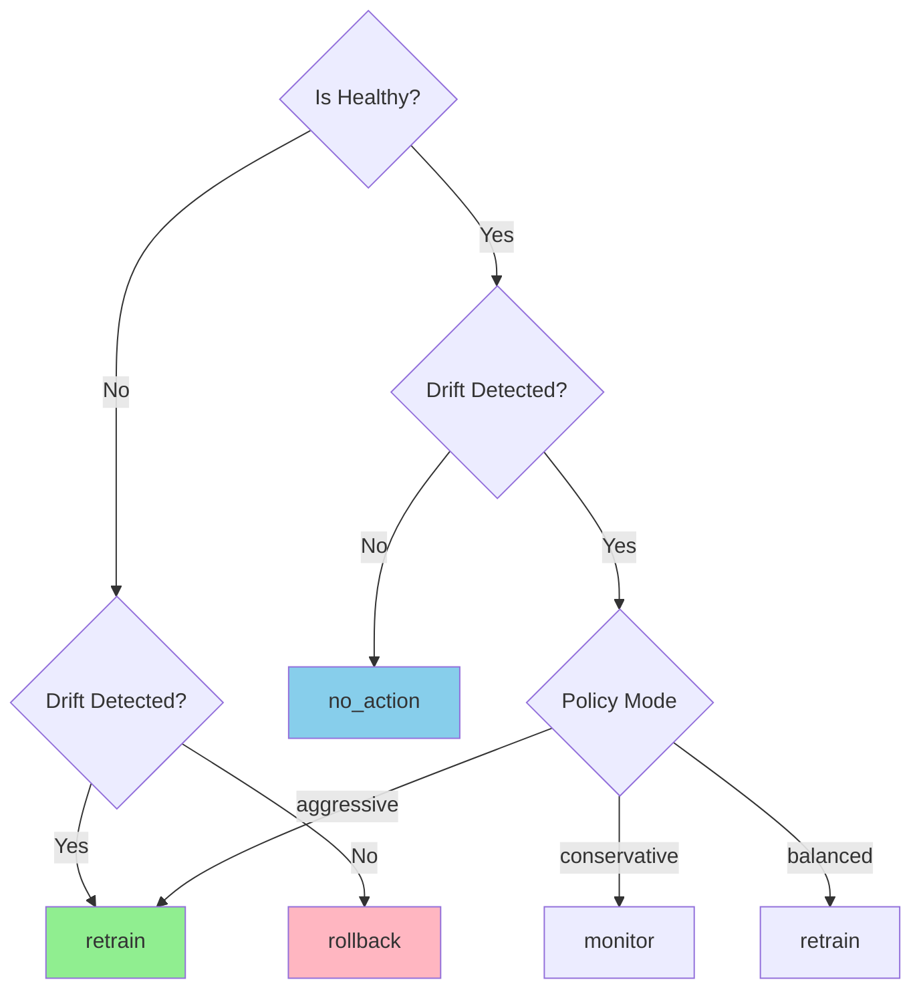
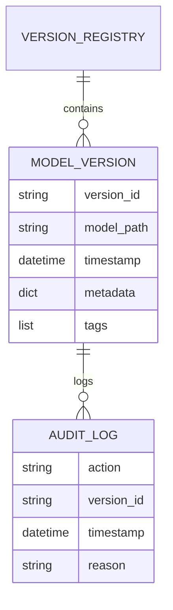
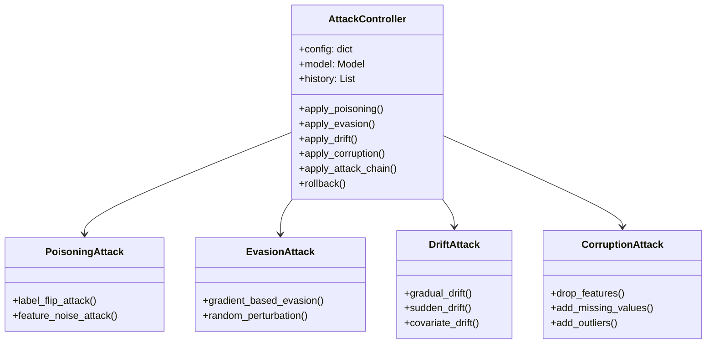
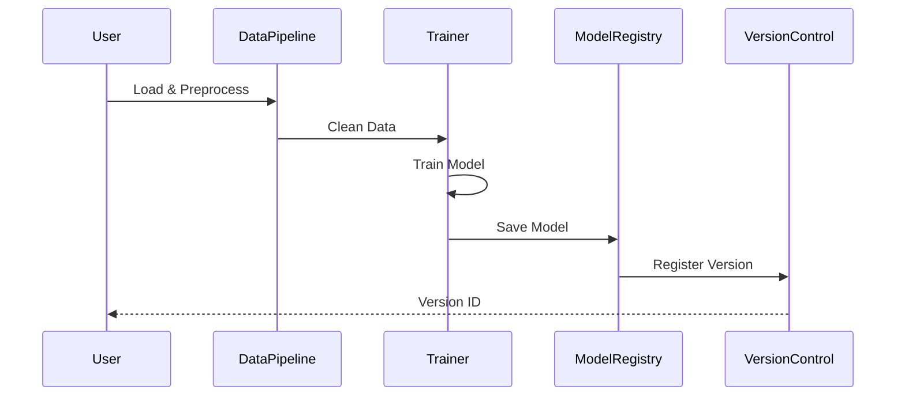
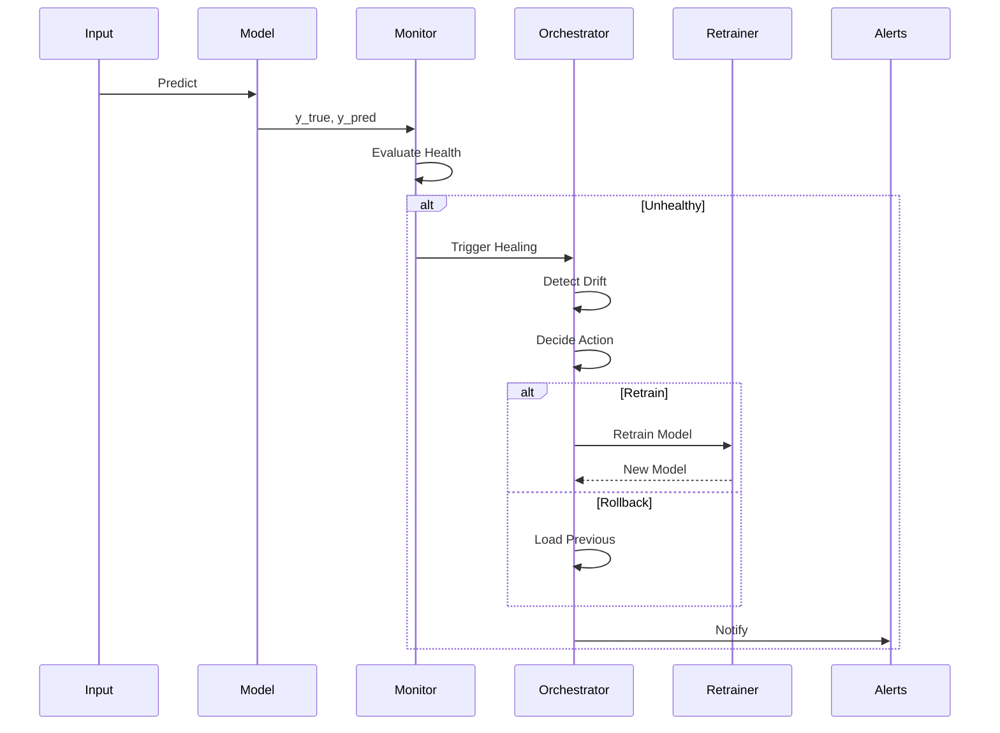

# Hydra-IDS System Architecture

## Table of Contents
- [System Overview](#system-overview)
- [Component Architecture](#component-architecture)
- [Data Flow](#data-flow)
- [Self-Healing Workflow](#self-healing-workflow)
- [Design Decisions](#design-decisions)
- [Scalability Considerations](#scalability-considerations)

## System Overview

Hydra-IDS is designed as a modular, production-ready intrusion detection system with automated maintenance capabilities. The architecture follows MLOps best practices with clear separation of concerns.

### High-Level Architecture



## Component Architecture

### 1. Data Pipeline

The data pipeline handles CICIDS-2017 dataset processing with memory-efficient operations.



**Key Features**:
- **Chunked Processing**: Handles large files without memory overflow
- **Schema Validation**: Ensures column consistency across files
- **Deduplication**: Removes duplicate records
- **Stratified Splitting**: Maintains class distribution

**Files**:
- [`scripts/convert_excel_to_csv.py`](file:///c:/Users/sidha/hydra-ids/scripts/convert_excel_to_csv.py)
- [`scripts/merge_raw_csvs.py`](file:///c:/Users/sidha/hydra-ids/scripts/merge_raw_csvs.py)
- [`scripts/preprocess_cicids.py`](file:///c:/Users/sidha/hydra-ids/scripts/preprocess_cicids.py)

### 2. ML Model Architecture

Multi-model support with automatic pipeline handling.



**Model Selection Criteria**:
- **XGBoost** (default): Best accuracy-speed tradeoff
- **Random Forest**: Interpretable, robust to outliers
- **Neural Network**: High capacity for complex patterns

**Training Pipeline**:
1. Load preprocessed data
2. Handle class imbalance (SMOTE/class weights)
3. Hyperparameter tuning (GridSearch/Optuna)
4. Cross-validation
5. Final evaluation on hold-out test set
6. Model serialization + versioning

### 3. Self-Healing System Architecture

The self-healing system is the core innovation of Hydra-IDS, providing automated model maintenance.



#### 3.1 Health Monitor

Tracks model performance with 6 metrics and trend analysis.

**Architecture**:
```python
HealthMonitor
├── Metrics Calculator
│   ├── Accuracy
│   ├── Precision
│   ├── Recall
│   ├── F1-Score
│   ├── ROC-AUC (optional)
│   └── PR-AUC (optional)
├── Trend Tracker
│   ├── Rolling Window (configurable)
│   ├── Degradation Detection
│   └── Historical Average
└── Adaptive Thresholds
    ├── Baseline Thresholds
    ├── Adaptation Rate
    └── Threshold Update Logic
```

**Key Algorithms**:
- **Degradation Detection**: Compares recent vs. historical averages
  ```
  degradation = older_avg - recent_avg
  is_degraded = degradation > threshold
  ```
- **Adaptive Thresholds**: Exponential moving average
  ```
  new_threshold = old_threshold * (1 - α) + hist_avg * α
  ```

#### 3.2 Drift Detector

Multi-method ensemble drift detection.



**Detection Methods**:

1. **Kolmogorov-Smirnov (KS) Test**
   - Statistical test for distribution similarity
   - Returns p-value (drift if p < 0.05)
   - Works well for continuous features

2. **Population Stability Index (PSI)**
   - Measures distribution shift
   - Formula: `PSI = Σ[(actual% - expected%) * ln(actual% / expected%)]`
   - Drift thresholds: <0.1 (stable), 0.1-0.2 (moderate), >0.2 (significant)

3. **Wasserstein Distance**
   - Earth Mover's Distance between distributions
   - Captures magnitude of shift
   - Normalized to [0, 1]

**Ensemble Logic**:
```python
drift_detected = (
    sum([ks_drift, psi_drift, wass_drift]) / 3 > threshold
)
drift_ratio = num_drifted_features / total_features
```

#### 3.3 Decision Engine

Intelligent action selection with confidence scoring.



**Action Types**:
1. **no_action**: Model healthy, no drift
2. **monitor**: Watch closely, no intervention
3. **retrain**: Train new model on recent data
4. **rollback**: Revert to previous version
5. **alert_only**: Notify but don't act
6. **emergency_stop**: Critical failure, stop predictions

**Confidence Calculation**:
```python
confidence = base_confidence * health_factor * drift_factor * history_factor
where:
  base_confidence = predefined per action
  health_factor = 1 - (degradation_score / max_degradation)
  drift_factor = drift_ratio if drift else 1.0
  history_factor = success_rate of past decisions
```

#### 3.4 Retrainer

Automated model retraining with incremental learning support.

**Training Strategies**:

1. **Full Retrain**: Train from scratch on all data
2. **Incremental**: Update existing model with new data
3. **Warm Start**: Initialize from previous model weights

**Hyperparameter Tuning**:
- **Optuna**: Bayesian optimization
- **Trials**: Configurable (default: 50)
- **Metrics**: Weighted F1-score
- **Early Stopping**: Patience-based

**Data Validation**:
```python
def validate_training_data(X, y):
    # Check for nulls
    assert not X.isnull().any().any()
    
    # Check class balance
    class_dist = y.value_counts(normalize=True)
    assert class_dist.min() > min_class_fraction
    
    # Check feature consistency
    assert set(X.columns) == set(reference_features)
```

#### 3.5 Rollback Manager

Version control for models with full audit trails.



**Versioning Strategy**:
- **Version ID**: `v{timestamp}_{hash}`
- **Tags**: `stable`, `latest`, `production`, `canary`
- **Metadata**: Performance metrics, training config
- **Cleanup Policy**: Keep N recent + all tagged

**Rollback Process**:
1. Identify target version (by tag or ID)
2. Validate version exists and is loadable
3. Create backup of current model
4. Load target version
5. Log rollback action
6. Alert stakeholders

#### 3.6 Alert System

Multi-channel notification system.

**Supported Channels**:
- **Console**: Immediate logging (always enabled)
- **Slack**: Team notifications
- **Email**: Stakeholder alerts
- **Webhook**: Custom integrations

**Severity Routing**:
```python
severity_channels = {
    'DEBUG': ['console'],
    'INFO': ['console', 'slack'],
    'WARNING': ['console', 'slack', 'email'],
    'ERROR': ['console', 'slack', 'email', 'webhook'],
    'CRITICAL': ['all']
}
```

**Deduplication**:
- Window: 5 minutes
- Key: (title + severity)
- Action: Suppress duplicates

#### 3.7 Orchestrator

Central coordinator for the self-healing workflow.

**Workflow Stages**:

1. **Stage 1: Health Monitoring**
   - Predict on current data
   - Evaluate metrics
   - Detect degradation

2. **Stage 2: Drift Detection**
   - Compare reference vs. current
   - Run all detection methods
   - Calculate drift ratio

3. **Stage 3: Decision Making**
   - Analyze health + drift
   - Select action
   - Verify rate limits

4. **Stage 4: Action Execution**
   - Execute decision (if not dry-run)
   - Handle errors gracefully
   - Log outcomes

5. **Stage 5: Validation**
   - Test new model (if applicable)
   - Compare performance
   - Rollback if worse

**Circuit Breaker**:
- Prevents cascading failures
- Trips after N consecutive failures
- Resets after cooldown period

### 4. Adversarial Testing Framework

Comprehensive attack simulation for robustness evaluation.



**Attack Chaining**:
Attacks can be applied sequentially to simulate worst-case scenarios.

Example chain:
```
Drift (strength=0.3) → Evasion (ε=0.05) → Corruption (drop=0.2)
```

**Metrics Tracked**:
- **Attack Effectiveness**: Weighted degradation score
- **Model Degradation**: Per-metric drops
- **Prediction Analysis**: Flip rate, evasion success
- **Resource Impact**: Time, memory

## Data Flow

### Training Flow



### Inference with Self-Healing



## Design Decisions

### 1. Why Multi-Method Drift Detection?

Single methods have weaknesses:
- **KS Test**: Sensitive to sample size, may miss subtle shifts
- **PSI**: Requires binning, loses information
- **Wasserstein**: Computationally expensive

**Solution**: Ensemble voting provides robust detection while avoiding false positives.

### 2. Why Adaptive Thresholds?

Fixed thresholds don't account for:
- Dataset characteristics
- Model evolution over time
- Different deployment contexts

**Solution**: Thresholds adapt based on historical performance, reducing false alarms.

### 3. Why Dry-Run Mode?

Production deployments require safety nets.

**Benefits**:
- Test workflows without side effects
- Validate configurations
- Review decisions before automation

### 4. Why Version Tagging?

Simple timestamps are insufficient for production:
- Need to identify "stable" vs "experimental"
- Support A/B testing
- Enable gradual rollouts

**Tags**: `latest`, `stable`, `production`, `canary`, `experimental`

### 5. Why Separate Health & Drift?

They measure different aspects:
- **Health**: Model performance (labels required)
- **Drift**: Data distribution (no labels required)

**Benefits**:
- Independent monitoring
- Faster drift detection (no labels needed)
- Clearer diagnostics

## Scalability Considerations

### Current Limitations

| Component | Limitation | Impact |
|-----------|------------|--------|
| Preprocessing | In-memory operations | ~10GB dataset limit |
| Drift Detection | Single-threaded | ~60s for 10k samples |
| Retraining | Synchronous | Blocks workflow |

### Scalability Roadmap

#### Phase 1: Optimization
- [ ] Parallel drift detection (per-feature)
- [ ] Async retraining (background jobs)
- [ ] Incremental preprocessing (streaming)

#### Phase 2: Distributed
- [ ] Multi-worker training (Ray/Dask)
- [ ] Distributed drift detection
- [ ] Federated learning support

#### Phase 3: Cloud-Native
- [ ] Kubernetes deployment
- [ ] Auto-scaling based on load
- [ ] Managed model serving (TFServing/Seldon)

### Performance Targets

| Metric | Current | Target (Phase 1) | Target (Phase 2) |
|--------|---------|------------------|-------------------|
| Inference Latency | ~50ms | ~20ms | ~10ms |
| Drift Detection | ~60s | ~20s | ~5s |
| Retraining Time | ~5min | ~2min | ~30s |
| Max Throughput | ~1k req/s | ~10k req/s | ~100k req/s |

## Technology Stack

### Core Dependencies
- **Python**: 3.8+
- **ML**: scikit-learn, XGBoost, pandas, numpy
- **Validation**: Pydantic, YAML
- **Monitoring**: MLflow, Prometheus
- **Drift**: Evidently, SciPy

### Optional Dependencies
- **Alerts**: Slack SDK, SendGrid
- **Tuning**: Optuna
- **Visualization**: Matplotlib, Seaborn

## Configuration Management

Hydra-IDS uses Pydantic for type-safe configuration.

**Config Hierarchy**:
```
SelfHealingConfig
├── HealthMonitorConfig
├── DriftDetectorConfig
├── DecisionEngineConfig
├── RetrainerConfig
├── RollbackConfig
├── AlertSystemConfig
└── OrchestratorConfig
```

**Sources** (priority order):
1. Explicit constructor args
2. YAML/JSON config file
3. Environment variables
4. Default values

**Example**:
```python
# From YAML
config = SelfHealingConfig.from_yaml('config.yaml')

# From environment
os.environ['DRIFT_THRESHOLD'] = '0.3'
config = SelfHealingConfig()

# Programmatic
config = SelfHealingConfig(
    drift_detector=DriftDetectorConfig(threshold=0.3)
)
```

## Security Considerations

### Model Security
- ✅ **Versioning**: Prevents unauthorized model replacement
- ✅ **Audit Logs**: Full traceability of changes
- ✅ **Validation**: Input/output schema checks
- ⚠️ **Authentication**: Not yet implemented
- ⚠️ **Encryption**: Models stored unencrypted

### Data Security
- ✅ **No PII**: CICIDS dataset contains only network metrics
- ✅ **Local Storage**: No external data transmission
- ⚠️ **Access Control**: File-system level only

### Adversarial Robustness
- ✅ **Attack Testing**: Comprehensive adversarial evaluation
- ✅ **Drift Detection**: Detects distributional attacks
- ⚠️ **Adversarial Training**: Not yet implemented
- ⚠️ **Certified Robustness**: Not yet implemented

## Monitoring & Observability

### Metrics Exposed

**Health Metrics**:
- `model_accuracy`, `model_precision`, `model_recall`, `model_f1`
- `health_status` (binary: healthy/unhealthy)
- `degradation_score`

**Drift Metrics**:
- `drift_detected` (binary)
- `drift_ratio` (fraction of drifted features)
- `ks_statistic`, `psi_score`, `wasserstein_distance`

**Operational Metrics**:
- `healing_workflows_total`
- `retraining_duration_seconds`
- `rollback_count`
- `alert_count_by_severity`

### Logging Strategy

**Levels**:
- **DEBUG**: Detailed execution traces
- **INFO**: Workflow progress, decisions
- **WARNING**: Degradation detected, rate limits
- **ERROR**: Component failures
- **CRITICAL**: System failures

**Structured Logging**:
```python
logger.info(
    "Workflow completed",
    extra={
        'workflow_id': 'healing_20260131',
        'action': 'retrain',
        'duration_seconds': 42.5
    }
)
```

---

**Last Updated**: 2026-01-31  
**Version**: 1.0  
**Authors**: Hydra-IDS Development Team
